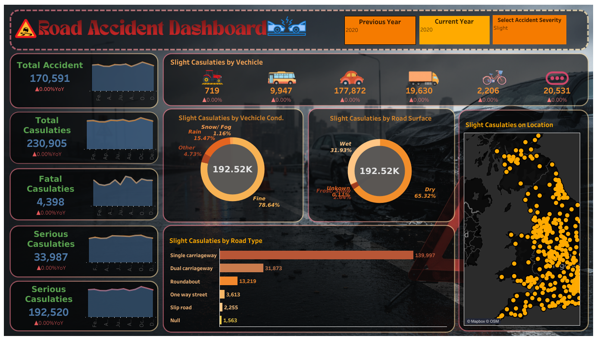

# 🚦 Road Accident Dashboard --- Tableau

An interactive **Road Accident Analysis Dashboard** built with
**Tableau** to analyze accident trends, casualty severity, road
conditions, vehicle types, weather conditions, and geographic
distribution.

The project uses a large road-accident dataset containing **660,679
accident records** and converts the raw data into an interactive visual
analytics solution for identifying accident patterns and year-over-year
changes.

------------------------------------------------------------------------

## 📊 Project Overview

Road accidents are influenced by multiple factors such as road type,
weather, lighting, surface conditions, vehicle type, and urban/rural
location. This project provides a centralized Tableau dashboard to
explore those factors and compare accident and casualty metrics across
years.

### Main objectives

-   Analyze the overall number of road accidents.
-   Track total casualties and their severity.
-   Compare **Current Year (CY)** with **Previous Year (PY)**.
-   Analyze fatal, serious, and slight casualties.
-   Identify accident patterns by road type and road-surface condition.
-   Study vehicle-type and weather-condition contributions.
-   Explore the geographic distribution of accidents.
-   Provide interactive filtering for better decision-making.

------------------------------------------------------------------------

## 🖥️ Dashboard Preview

> Add the exported dashboard image to the repository as
> `assets/dashboard.png` and keep the following image reference.



------------------------------------------------------------------------

## 🛠️ Technology Stack

  -----------------------------------------------------------------------
  Technology                          Purpose
  ----------------------------------- -----------------------------------
  **Tableau**                         Dashboard development and
                                      interactive visualization

  **CSV**                             Source dataset

  **Tableau Calculated Fields**       KPI, YoY, severity, and year-based
                                      calculations

  **Tableau Parameters**              Current Year, Previous Year, and
                                      Accident Severity selection

  **Tableau Maps**                    Geographic accident analysis

  **Tableau Packaged Workbook         Portable dashboard and data extract
  (.twbx)**                           package
  -----------------------------------------------------------------------

------------------------------------------------------------------------

## 📁 Project Structure

``` text
Road-Accident-Dashboard/
│
├── README.md
├── accident data.csv
├── Road Accident Dashboard.twbx
│
└── assets/
    └── dashboard-preview.png
```

### File descriptions

-   `accident data.csv` --- Raw road accident dataset used for analysis.
-   `Road Accident Dashboard.twbx` --- Packaged Tableau workbook
    containing the dashboard and Tableau extract/resources.
-   `assets/dashboard-preview.png` --- Dashboard preview image for the
    GitHub README.

------------------------------------------------------------------------

## 📦 Dataset Information

The dataset contains **660,679 records** and **14 columns**.

### Dataset columns

  -----------------------------------------------------------------------
  Column                              Description
  ----------------------------------- -----------------------------------
  `Index`                             Unique accident identifier

  `Accident_Severity`                 Accident severity: Fatal, Serious,
                                      or Slight

  `Accident Date`                     Date on which the accident occurred

  `Latitude`                          Geographic latitude

  `Longitude`                         Geographic longitude

  `District Area`                     District/administrative area

  `Light_Conditions`                  Lighting condition at the time of
                                      the accident

  `Number_of_Casualties`              Number of casualties associated
                                      with the accident

  `Number_of_Vehicles`                Number of vehicles involved

  `Road_Surface_Conditions`           Road surface condition

  `Road_Type`                         Type of road

  `Urban_or_Rural_Area`               Urban, rural, or related area
                                      classification

  `Weather_Conditions`                Weather condition during the
                                      accident

  `Vehicle_Type`                      Type of vehicle involved
  -----------------------------------------------------------------------

### Dataset coverage

-   **Records:** 660,679
-   **Features:** 14
-   **Time period:** 2019--2022
-   **Accident severity classes:** 3
-   **District areas:** 422
-   **Vehicle types:** 16
-   **Road types:** 5
-   **Weather categories:** 8
-   **Road-surface categories:** 5
-   **Total casualties in dataset:** 896,568

------------------------------------------------------------------------

## 📅 Year-wise Dataset Distribution

    Year   Accident Records
  ------ ------------------
    2019            182,115
    2020            170,591
    2021            163,554
    2022            144,419

The dashboard is designed around year comparison, with **2021 as the
default Current Year** and **2020 as the default Previous Year** in the
supplied Tableau workbook.

------------------------------------------------------------------------

## 🎯 Dashboard KPIs

The dashboard uses calculated fields and parameters to create dynamic
KPIs.

### 1. Total Accidents

Counts accident records for the selected year.

Conceptually:

``` text
Total Accidents =
COUNT(Accident Index)
for the selected year
```

### 2. Total Casualties

Calculates the sum of casualties for the selected year.

``` text
Total Casualties =
SUM(Number_of_Casualties)
for the selected year
```

### 3. Fatal Casualties

Calculates casualties associated with fatal accidents.

``` text
Fatal Casualties =
SUM(Number_of_Casualties)
where Accident Severity = Fatal
```

### 4. Serious Casualties

Calculates casualties associated with serious accidents.

``` text
Serious Casualties =
SUM(Number_of_Casualties)
where Accident Severity = Serious
```

### 5. Slight Casualties

Calculates casualties associated with slight accidents.

``` text
Slight Casualties =
SUM(Number_of_Casualties)
where Accident Severity = Slight
```

### 6. Year-over-Year (YoY) Analysis

The workbook contains calculated fields for comparing the current year
against the previous year.

General formula:

``` text
YoY % =
(Current Year Value - Previous Year Value)
/
Previous Year Value
```

This approach is used for accident counts and casualty-severity metrics.

------------------------------------------------------------------------

## 🎛️ Interactive Controls

The Tableau workbook contains parameters for interactive analysis.

### Current Year

Allows the user to select the year used for current-year calculations.

Available years in the workbook include:

-   2019
-   2020
-   2021
-   2022

### Previous Year

Allows comparison against a selected previous year.

### Accident Severity

The dashboard supports severity-based filtering, including:

-   Fatal
-   Serious
-   Slight
-   All

This makes it possible to focus the analysis on a particular accident
severity category.

------------------------------------------------------------------------

## 📈 Dashboard Visualizations

The workbook contains multiple worksheets that feed the main dashboard.

  -----------------------------------------------------------------------
  Worksheet                           Purpose
  ----------------------------------- -----------------------------------
  `Total Accident`                    Displays total accident KPI

  `Total Casulaties`                  Displays total casualty KPI

  `Fatal Casulaties`                  Displays fatal casualty analysis

  `Serious Casulaties`                Displays serious casualty analysis

  `Slight Casulaties`                 Displays slight casualty analysis

  `By Location`                       Geographic accident distribution

  `Raod Type`                         Analysis by road type

  `Road Surface Cond`                 Analysis by road-surface condition

  `Vechicle Type`                     Analysis by vehicle type

  `Weather Cond`                      Analysis by weather condition

  `Accident Sparkling`                Accident trend / comparison
                                      visualization

  `Total Casulaties Sparkling`        Casualty trend / comparison
                                      visualization

  `serious sparkline`                 Serious casualty trend

  `slight sparkline`                  Slight casualty trend
  -----------------------------------------------------------------------

> Some worksheet names retain their original spelling from the supplied
> Tableau workbook.

------------------------------------------------------------------------

## 🔍 Key Analysis Areas

### 🚘 Road Type

The dashboard examines how accidents and casualties vary across
different road types, helping identify road environments associated with
higher accident activity.

### 🛣️ Road Surface Conditions

Road conditions such as dry, wet/damp, snow, frost, and other recorded
conditions can be compared to understand their relationship with
accident occurrence.

### 🌧️ Weather Conditions

Weather categories are used to examine whether accident patterns change
under different environmental conditions.

### 💡 Light Conditions

The dashboard considers daylight and darkness-related lighting
conditions to support analysis of visibility-related accident patterns.

### 🚗 Vehicle Type

Vehicle categories are analyzed to determine which vehicle types are
most frequently represented in accident records.

### 📍 Geographic Distribution

Latitude and longitude fields support map-based visualization of
accident locations and geographic concentration.

### ⚠️ Accident Severity

Accidents are classified into:

-   **Fatal**
-   **Serious**
-   **Slight**

Severity filtering allows users to investigate the characteristics of
more severe accidents separately from overall accident volume.

------------------------------------------------------------------------

## 📌 Example Insights from the Dataset

For the default workbook comparison of **2021 vs 2020**:

  Metric                    2020      2021    YoY Change
  -------------------- --------- --------- -------------
  Accidents              170,591   163,554    **-4.13%**
  Casualties             230,905   222,146    **-3.79%**
  Fatal casualties         4,398     3,879   **-11.80%**
  Serious casualties      33,987    32,311    **-4.93%**
  Slight casualties      192,520   185,956    **-3.41%**

These values are calculated directly from the supplied CSV and are
included as reference statistics. The Tableau dashboard remains
interactive and can produce different results when the selected year or
severity filter changes.

------------------------------------------------------------------------

## 🧹 Data Quality

The dataset contains some missing values.

Notable missing-value counts include:

  Column                        Missing Values
  --------------------------- ----------------
  `Road_Surface_Conditions`                726
  `Road_Type`                            4,520
  `Urban_or_Rural_Area`                     15
  `Weather_Conditions`                  14,128
  `Latitude`                                25
  `Longitude`                               26

The Tableau workbook is designed to work with the supplied data and
handles categorical dimensions according to the visualization/filter
configuration.

------------------------------------------------------------------------

## 🚀 How to Use the Project

### Option 1 --- Open the packaged Tableau workbook

1.  Install **Tableau Desktop**.
2.  Clone or download this repository.
3.  Open:

``` text
Road Accident Dashboard.twbx
```

4.  Allow Tableau to load the packaged extract/resources.
5.  Open the `Dashboard` sheet.
6.  Use the year and severity controls to interact with the dashboard.

### Option 2 --- Inspect the dataset

The raw data can be opened with:

-   Python / Pandas
-   Microsoft Excel
-   Tableau
-   Power BI
-   Other data-analysis tools

Example:

``` python
import pandas as pd

df = pd.read_csv("accident data.csv")

print(df.shape)
print(df.head())
print(df.info())
```

------------------------------------------------------------------------

## 🧮 Example Python Data Exploration

``` python
import pandas as pd

df = pd.read_csv("accident data.csv")

# Convert date
df["Accident Date"] = pd.to_datetime(
    df["Accident Date"],
    dayfirst=True,
    errors="coerce"
)

# Accident count by year
yearly_accidents = (
    df.groupby(df["Accident Date"].dt.year)
      .size()
      .reset_index(name="Accidents")
)

print(yearly_accidents)

# Casualties by severity
severity_analysis = (
    df.groupby("Accident_Severity")["Number_of_Casualties"]
      .sum()
      .sort_values(ascending=False)
)

print(severity_analysis)
```

------------------------------------------------------------------------

## 📊 Tableau Calculated-Field Approach

The workbook uses Tableau calculated fields for dynamic year-based
analysis.

A typical current-year accident calculation follows this logic:

``` text
IF YEAR([Accident Date]) = [Current Year]
THEN [Index]
END
```

A severity-specific casualty calculation follows this pattern:

``` text
IF [Accident_Severity] = "Serious"
AND YEAR([Accident Date]) = [Current Year]
THEN [Number_of_Casualties]
END
```

This allows the dashboard to update automatically when the user changes
parameters.

------------------------------------------------------------------------

## 🎓 Skills Demonstrated

This project demonstrates practical skills in:

-   Data visualization
-   Tableau dashboard development
-   Data cleaning and exploration
-   Calculated fields
-   Tableau parameters
-   KPI design
-   Year-over-Year analysis
-   Geographic visualization
-   Categorical analysis
-   Accident severity analysis
-   Dashboard layout and UI design
-   Data storytelling
-   Business intelligence

------------------------------------------------------------------------

## 💼 Resume Project Description

**Road Accident Analysis Dashboard \| Tableau**

> Developed an interactive Tableau dashboard using 660K+ road accident
> records to analyze accident trends, casualty severity, road
> conditions, weather, vehicle types, and geographic distribution.
> Implemented dynamic year and severity parameters, KPI cards, YoY
> analysis, trend visualizations, and location-based analysis to
> identify key road-safety patterns.

------------------------------------------------------------------------

## 🔮 Future Enhancements

Possible improvements include:

-   Add monthly and weekly accident trend analysis.
-   Add time-of-day analysis.
-   Add accident severity percentage KPIs.
-   Add drill-down from country/region to district.
-   Add advanced map layers and geographic clustering.
-   Add anomaly detection for unusual accident patterns.
-   Add predictive modeling for accident severity.
-   Integrate live or periodically refreshed data.
-   Publish the dashboard to Tableau Public or Tableau Server.
-   Add a dedicated data-quality monitoring section.

------------------------------------------------------------------------

## ⚠️ Limitations

-   The analysis is based on the supplied dataset and its recorded
    attributes.
-   Missing values exist in several categorical and geographic fields.
-   Correlation between an accident factor and accident severity should
    not be interpreted automatically as causation.
-   The dashboard is descriptive/diagnostic rather than a production
    accident-risk prediction system.

------------------------------------------------------------------------

## 👨‍💻 Author

**Mohit Sapkal**

B.Tech --- Artificial Intelligence & Data Science

------------------------------------------------------------------------

## ⭐ If You Find This Project Useful

If this project helps you learn Tableau, data visualization, or
road-safety analytics:

-   ⭐ Star the repository
-   🍴 Fork the repository
-   💬 Share feedback
-   🔗 Connect with me on GitHub

------------------------------------------------------------------------

## 📄 License

This project is provided for **educational and portfolio purposes**.
Review the original dataset's licensing and usage terms before
redistributing the data.
